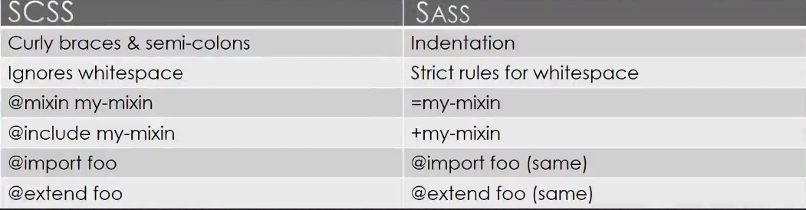

## What is sass
  sass means two things:
    - A css preprocessor
    - A language

  sass: syntactically awesome style-sheets, original language
  scss: Sassy css, is a super-set of CSS3's syntax. 

  sass preprocessor supports two syntax:
    - sass
    ```
    .container
      float: left
      width: 100%
      p
        color: #666
    ```
    - scss, a css-like syntax, in sass 3
    ```
    .container{
      float: left;
      width: 100;
      p {
        color: #666
      }
    }
    ```
    

## Powerful capabilities
  - variables
  - nesting
  - mixin
  - automatic vendor prefixing
